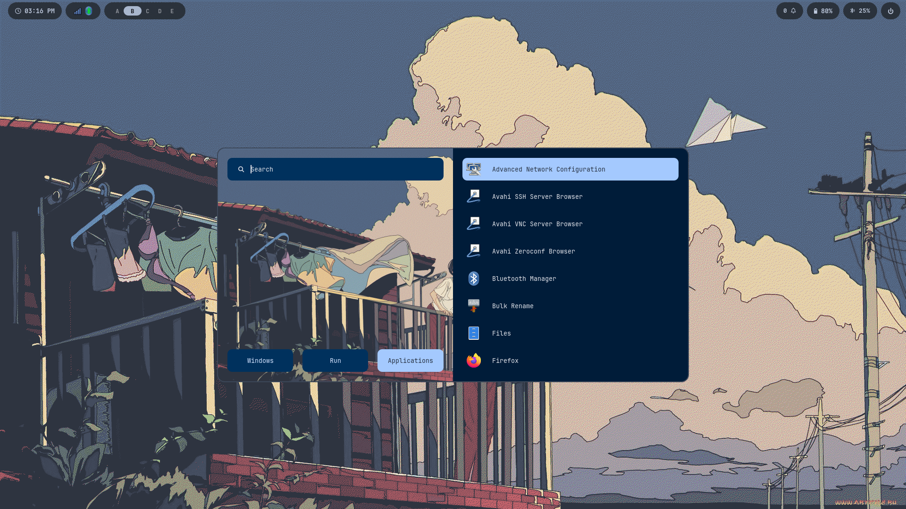

# 🍚 Arch Linux + Hyprland Dotfiles

Welcome to my personal Arch Linux dotfiles repository! This setup is a highly customized, visually cohesive Wayland environment built around **Hyprland**. It features dynamic color generation, a custom Waybar, and automated installation via GNU Stow.


*(Note: To add your screenshot, create an `assets` folder in this repo, drop your image in as `preview.png`, and it will load here!)*

## 🌟 Core Components

* **Window Manager:** [Hyprland](https://hyprland.org/) (Wayland)
* **Bar:** Waybar (Custom themed modules)
* **Terminal:** Kitty
* **Shell:** Zsh
* **App Launcher:** Rofi (Wayland fork)
* **Color Engine:** Matugen (Dynamic GTK/UI theming)
* **Lockscreen:** Hyprlock + Hypridle
* **Clipboard Manager:** Cliphist (Integrated with Rofi)
* **Notification Daemon:** SwayNC

---

## 🚀 Installation Guide (From Absolute Scratch)

These instructions assume you have just completed a base Arch Linux installation and are logged into a bare terminal with an active internet connection.

### 1. Install Base Dependencies

First, make sure your system is up to date and has the core tools required to download and build packages.

```bash
sudo pacman -Syu
sudo pacman -S --needed git base-devel
```

### 2. Install an AUR Helper (yay)

The Arch User Repository (AUR) contains many of the custom themes and Wayland tools used in this rice. We need to install `yay` to easily access them.

```bash
git clone https://aur.archlinux.org/yay.git
cd yay
makepkg -si
cd ..
rm -rf yay
```

### 3. Clone This Repository

Download these dotfiles directly into your home folder.

```bash
git clone https://github.com/BruhGamer05/arch-dotfiles.git ~/arch-dotfiles
```

### 4. Run the Bootstrap Script

Navigate into the dotfiles folder and run the master installation script. This script will automatically read the `pkglist.txt`, install all required packages (including fonts and themes), and use GNU Stow to symlink all the configurations exactly where they belong.

```bash
cd ~/arch-dotfiles
chmod +x install.sh
./install.sh
```

---

## ⚙️ Post-Installation System Tweaks

Because dotfiles only back up user configurations, you need to execute this final step to perfectly replicate the terminal environment.

### Change Default Shell to Zsh

This setup relies on Zsh for the terminal environment. Change your default shell by running:

```bash
chsh -s $(which zsh)
```

(Log out and log back in, or reboot your system, for this to take effect).

---

## 📂 How to Maintain This Repository

This repository uses GNU Stow to manage symlinks.

If you want to modify a config, simply edit the file normally on your system (e.g., `nano ~/.config/waybar/config`). Because it is a symlink, the changes are actually being saved directly inside `~/arch-dotfiles/waybar`.

To back up your future changes, just use standard Git commands inside the dotfiles folder:

```bash
cd ~/arch-dotfiles
git add .
git commit -m "Updated configuration"
git push origin master
```
